<!-- $theme: default -->
<!-- page_number: true -->

# AWS社内勉強会
## 第2回(AWS入門)
- 講義実施者 : 荒木　泰詞
- 講義実施日 : 2018-08-XX

---
## 今回のゴール
- AWS主要サービスの理解

---
## アジェンダ
- AWS全体像
- VPCとは
- EC2とは
- S3とは
- ELBとは
- RDSとは
- 構成例
- まとめ

---
## AWS全体像
### 基本的な考え方
- 必要なときに、必要なだけ、低価格でサービスを提供
- 約100サービス存在する
- 個々のサービス自体は基本的かつ汎用的な機能の集まり
- 組み合わせることで柔軟なシステムやサービスが構築できる
- 無理に全てのサービスは使わない
- 必要になった段階でAWSサービスを導入していく

---
### サービス群
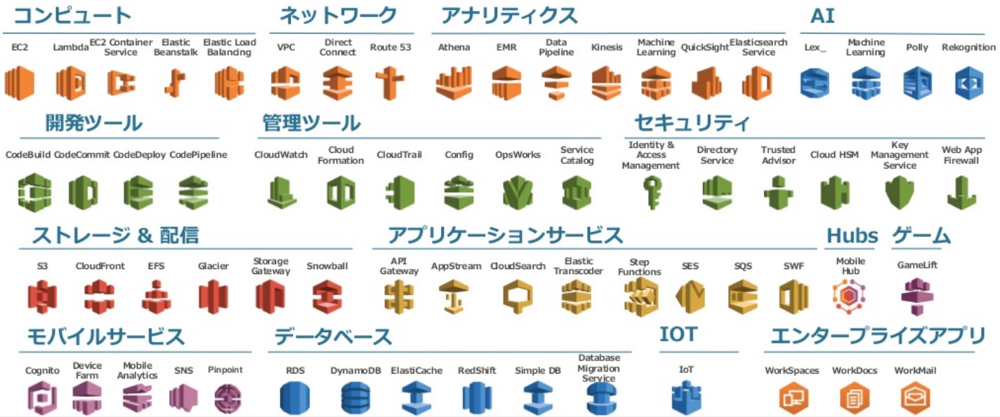

---
## 物理的な構成 - リージョン
### リージョンとは、AWSがサービスを提供している拠点のこと
### 18リージョン存在する
- 米国東部（バージニア北部）
- 米国東部 (オハイオ)
- アジアパシフィック (東京)
- アジアパシフィック (ソウル)
- ・・・

### リージョンによって利用できるサービスが異なる
- 本社はアメリカにあるのでバージニア北部などに最新サービスが優先的に利用できるようになる

---
## 物理的な構成 - リージョン
### サービスはどのリージョンでも同じ
- サービスの操作（ブラウザ、API）はリージョンでの差分はない
- 後々の自動化で役立つ

### どのリージョンを使用するか
- AWS上で稼働するシステムを利用するユーザに近いリージョン
  - 遠いリージョンにするとネットワークの通信に時間がかかり、システムのレスポンスに影響を与えることがある
- 最新サービスやコスト面を考慮してバージニア北部リージョン
  - 最近では遠いリージョンでも遅延は少なくなってきている
  - 日本企業でも全サービスをバージニア北部で利用するケースが増えている
  - 土地代や電気代が東京に比べてバージニア北部のほうが安いので、サービス料金も東京リージョンより安い傾向

---
## 物理的な構成 - アベイラビリティゾーン
### アベイラビリティゾーン（AZ）とは、１つまたは複数のデータセンターの集合体
- データセンターとは、サーバなどのインフラ設備を設置・運用する施設

---
## 物理的な構成 - アベイラビリティゾーン

### リージョンによって利用できるAZの数は異なる
|リージョン|AZ数|
|-|:-:|
|バージニア北部|6|
|オハイオ|3|
|東京|4|
|ソウル|2|

### マルチAZ構成とは、複数のAZを利用したシステム構成のこと
- マルチAZにすることで可用性や耐障害性を高める
- AWS推奨構成
- 各AZ間の遅延は2〜3ミリ秒程度

---
### リージョンとAZのイメージ


---
## VPC
### VPC(Virtual Private Cloud)とは、AWS上にプライベートネットワーク空間を構築できるサービス
- IPアドレスの範囲を指定して作成する
- VPCを作成し、いくつかの設定を行うことで他のAWSサービスやアプリケーションにアクセスできるようになる
- AWSでシステム構築する上でかかせないサービス

---
## VPCイメージ
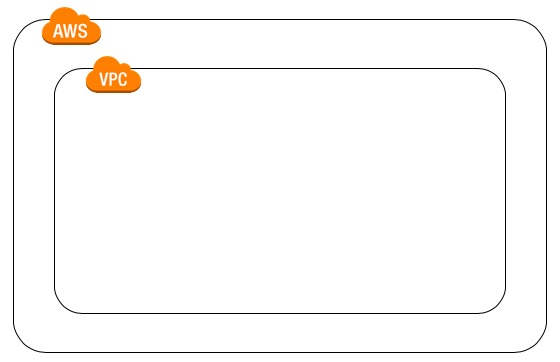

---
## VPC - サブネット
### サブネットとは、VPCのIPアドレスを区切った領域
- VPCを区切ることでサブネット単位でアクセス制御ができる
- AZを指定して作成する
- 2種類のサブネットがある
  - パブリックサブネット
    - インターネットに接続できるサブネット
  - プライベートサブネット
    - インターネットに接続できないサブネット
- サブネットがインターネットに接続するかどうかはルートテーブルの設定で決まる

---
## サブネットイメージ
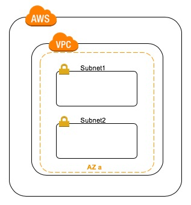

---
## VPC - ルートテーブル
### ルートテーブルとは、ネットワークトラフィックの経路を判断する
- ルートテーブルにサブネットを紐付ける
- ルートテーブルにゲートウェイを紐付ける
  - インターネットゲートウェイ
    - これとサブネットが紐付いていると`パブリック`サブネット
  - NATゲートウェイ
    - これとサブネットが紐付いていると`プライベート`サブネット
---
## VPC - インターネットゲートウェイ
### インターネットゲートウェイとは、VPCとインターネットを接続を相互にできようにする
- インターネットゲートウェイを作成
- VPCにアタッチすることで利用可能

---
## VPC - NATゲートウェイ
### NATゲートウェイとは、サブネットからインターネットへ接続できるが、インターネットからサブネットには接続できないようにする
- 外部から接続される危険性を減らす
- パブリックサブネット内で作成する
- Elastic IPが必要
  - AWSでは基本的にIPアドレスは日々変わる
  - IPアドレスを固定したいときにElastic IPを使用する

---
## ルートテーブル、各種ゲートウェイイメージ
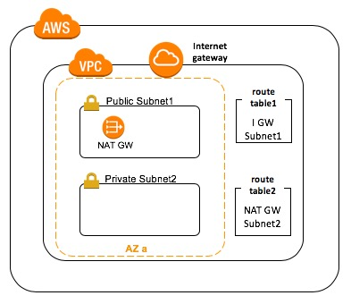

---
### VPCまとめ
- VPCとはAWS上にプライベートネットワーク空間を構築できるサービス
- VPCを作成しただけではインターネット通信はできない
- サブネット、ルートテーブル、インターネットゲートウェイ等を設定することでインターネットと通信ができる状態になる

---
## EC2
### EC2(Elastic Compute Cloud)とは、仮想サーバ
- 仮想サーバ（AWSでは`インスタンス`ともいう）
  - AMI
  - EBS
  - インスタンスタイプ
  - セキュリティグループ
- サブネットに配置する
- AWSの主軸サービス

---
## EC2 - AMI
### AMI(Amazon Machine Image)とは、仮想サーバであるインスタンス起動に必要な情報をまとめたもの
- AWSが用意しているAMIやユーザが用意したAMIなどがある
  - Amazon Linux AMI
  - Red Hat Linux
  - Ubuntu Server 16.04
- AMIを使うことですぐにインスタンスの構築ができる

---
## EC2 - EBS
### EBS(Elastic Block Store)とは、EC2と組み合わせて使用する、永続的なブロックストレージボリュームのこと
- オンプレ的にはHDD/SSDに相当する
- EC2のデータ保存場所
- 可用性が99.999%
- 容量を指定でき、増加もできる
  - 減少はできない

---
## EC2 - インスタンスタイプ
### インスタンスタイプとは、インスタンスの基本スペックの種類
- インスタンスタイプを容易に変更ができる

|モデル|CPU|メモリ(GB)|
|-|-|-|
|t2.nano|1|0.5|
|t2.micro|1|1|
|t2.small|1|2|
|...|...|...|
|m5.large|2|8|
|m5.xlarge|4|16|
|m5.2xlarge|8|32|

---
## EC2 - セキュリティグループ
### セキュリティグループとは、インスタンスの通信を制御する仮想ファイアファイアウォールとして機能する
- セキュリティグループを設定しないとEC2にはアクセスできない
- 許可したい通信情報を設定する
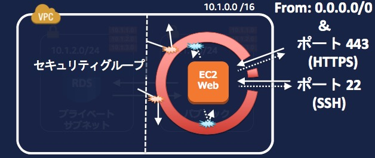

---
## EC2イメージ
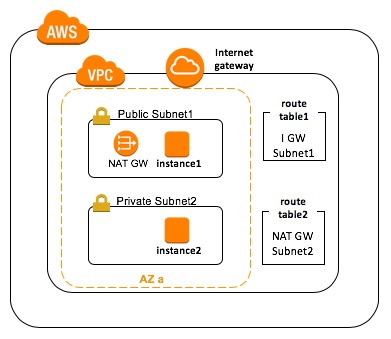

---
## EC2まとめ
- EC2とは仮想サーバ（インスタンス）
- EBSやインスタンスタイプを変更できるのでスモールスタートができる
- セキュリティグループを設定しないとEC2にアクセスできない

---
## S3
### S3(Simple Storege Service)とは、99.999999999%の耐久性を実現するよう設計された容量無制限のストレージサービス
- データを安全に、どこからでも、容量制限なく保存可能
- コストが低い
  - 月額1GB/約3円
- リージョン単位で作成
- AWSの主軸サービス

---
### S3 - バケットとオブジェクト
### バケットとは、オブジェクトの保存場所
- バケット内にフォルダを作ることもできる

### オブジェクトとは、データ本体であるファイルのこと

---
## バケットとオブジェクトの参考イメージ


<!-- *footer: https://www.slideshare.net/AmazonWebServicesJapan/aws-black-belt-online-seminar-2017-amazon-s3 -->

---
## S3イメージ
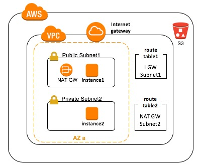

---
## S3まとめ
- S3とは、99.999999999%の耐久性を実現するよう設計された容量無制限のストレージサービス
- バケットとオブジェクトでデータを管理する

---
## ELB
### ELB(Elastic Load Balancing)とは、アプリケーションへのトラフィックを複数のターゲット（EC2, コンテナ等）に自動的に分散するサービス
- 耐障害性が高い
- アプリケーションの自動スケーリング
- ３種類から選択
  - CLB(Classic Load Balancer): 低性能
  - ALB(Application Load Balancer): 汎用性能
  - NLB(Network Load Balancer): 高性能

---
## ロードバランサー
### ロードバランサーとは、サーバにかかる負荷を平等に振り分ける装置のこと
- Webサイトへのアクセス集中が起きても安定したサービス提供可能
- 故障したサーバには接続しない
- 複数のサーバがないと効果を発揮しない

```
ロードバランサー ┬ サーバ１
　　　　　　　　 ├ サーバ２
　　　　　　　　 └ サーバ３
```

---
## 自動スケーリング
### 自動スケーリング(Auto Scaling)とは、自動でサーバの台数を調整する
- 指定したしきい値によって自動でサーバ台数を調整
  - CPU平均使用率が80%
  - アクセス数が1000
- スケールアウト: サーバを増やす
- スケールイン: サーバを減らす

---
### 自動スケーリングイメージ
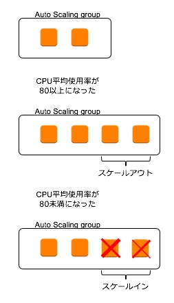

---
## ALBイメージ
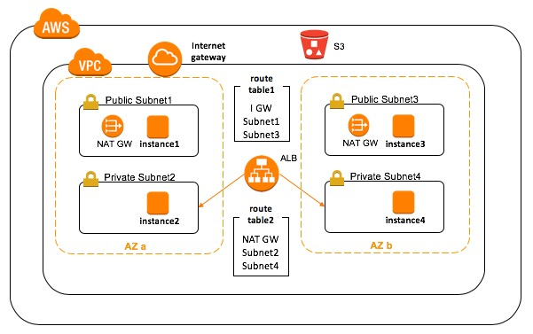

---
## ELBまとめ
- ELBとは、アプリケーションへのトラフィックを複数のターゲット（EC2, コンテナ等）に自動的に分散するサービス
- 耐障害性に強く、自動スケーリングによってサービスが継続できるようにする

---
## RDS
### RDS(Relational Database Service)とは、クラウド上でリレーショナルデータベース（RDMS）を利用できるサービス
- 6種類のRDMSが使える
  - MySQL
  - PostgreSQL
  - Oracle
  - Microsoft SQL Server
  - MarinaDB
    - MySQLから派生
  - Amazon Aurora
    - AWS独自
- マルチAZ配置による冗長化構成
- リードレプリカによるパフォーマンス向上

---
## Aurora
### Auroraとは、AWSがRDMSを独自に再設計したサービス
- MySQL, PostgreSQLと互換性がある
- 通常のMySQLやPostgreSQLに比べて、数倍性能が良い
- 通常のMySQLやPostgreSQLに比べて、コストが高い
- 自動バックアップ機能などがある

---
## マルチAZ配置
### マルチAZ配置とはプライマリ（マスター）インスタンスとスタンバイ（スレーブ）インスタンスを異なるAZに配置する
- プライマリインスタンスで障害があった場合、自動でスタンバイインスタンスがプライマリインスタンスに切り替わる
  - フェイルオーバーという

---
## リードレプリカ
### リードレプリカとは、DBインスタンスのキャパシティを伸縮自在にスケールし、読み取り頻度の高い処理のパフォーマンスを向上する
- 読み取りしかできないDBインスタンス
- 書き込み処理をしないような分析処理などを行うときに効果を発揮
- プライマリインスタンスに負荷をかけずに処理できる
- リードレプリカを複製してリードレプリカに対する負荷を軽減することもできる

---
## RDSイメージ
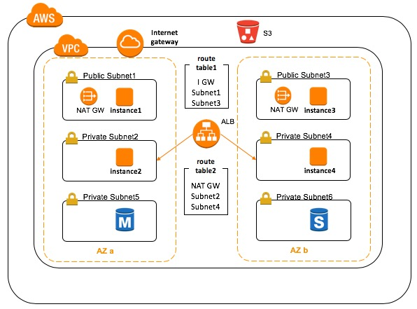

---
## RDSまとめ
- RDSとは、クラウド上でリレーショナルデータベース（RDMS）を利用できるサービス
- マルチAZ配置やリードレプリカを使うことで耐障害性を高める

---
## 構成例
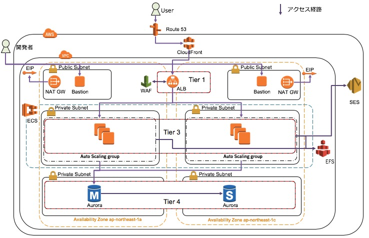

---
## まとめ
- 今回のAWS主要サービスはVPC, EC2, S3, ELB, RDS
- 上記のサービスを組み合わせることでWebサービスを構築できる
- 今回紹介したサービスには他にもいろんな機能がある
- 基本的な内容を抑えつつ、他の機能にも触れてみると良い