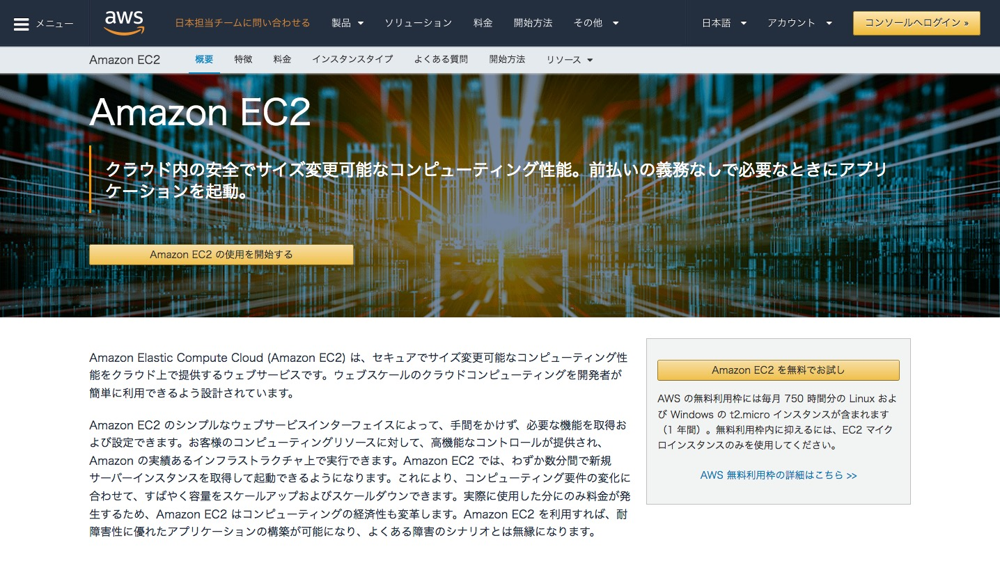
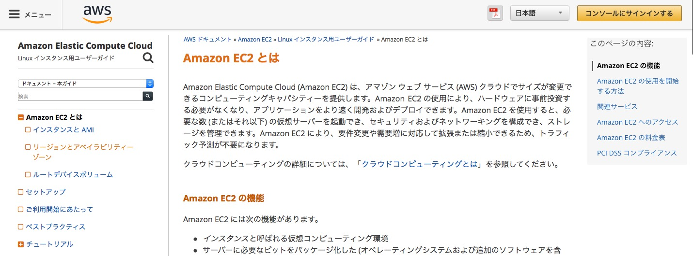

<!-- $theme: default -->
<!-- page_number: true -->

# AWS社内勉強会
## 第3回(AWSの学び方)
- 講義実施者 : 荒木　泰詞
- 講義実施日 : 2018-08-XX

---
## 今回のゴール
- AWSをどう学んでいくか理解する

---
## アジェンダ
- AWS公式の利用
  - ドキュメント
  - セミナー
- 本を読む
- 荒木の学習方法
- まとめ

---
## どうやって学ぶ？
- サービスがいろいろありすぎて、どこから手をつければ良いの？
- 概要はなんとなくわかったけど、実際にはどうやれば良いの？

### そういった悩みの道標となりたい

---
## AWS公式の利用
### 公式を使った学習方法としては大きく２つある
- AWSが用意しているドキュメントを読む
- AWSが主催しているセミナーの参加

---
## ドキュメント
### AWSがドキュメントを作成しているので知りたい情報が揃っている
- 概要
- チュートリアル
- ベストプラクティス

---
## ドキュメント
### とりあえず知りたいサービス名でググる
- `aws ec2`

- サービスのトップページだけでもある程度の概要がわかりやすく載っている

---
## ドキュメント
## [AWSドキュメント](https://aws.amazon.com/jp/documentation/)
### ユーザガイド、開発者ガイドなどがある
1. 知りたいサービス名のリンク押下
1. Linux インスタンス用ユーザーガイドリンク押下

---
## ドキュメント
### ドキュメントを読んでいると実際の操作手順がある
- 実際に動かすことで理解がとても深まる

### 動かすにはAWSアカウントが必要
- 個人でやろうとするとお金がかかる。。
  - ケースによるが目安としてはひと月数千円ぐらい
- が、FTLであれば学習用のアカウントを作ってもらえる
  - お金は会社持ち！
  - ありがたい！
  - 学習用アカウントはいつでも発行可能なので諸富さんに連絡する

---
## ドキュメント
### [ホワイトペーパー](https://aws.amazon.com/jp/whitepapers/)
- AWSやコミュニティなどで扱った豊富なドキュメント
- AWS入門のカテゴリもあるので、ひとまずこれを読破するのもあり
- ものによって英語しかないドキュメントもある

---
## セミナー
### AWSはいろんなセミナーをやっている

### まずはこれ
- [無料オンライントレーニング](https://aws.amazon.com/jp/training/mc_cloudpractitioner/?sc_channel=em&sc_campaign=Cert%20Launch&sc_medium=em_103003&sc_content=REG_la_traincert&sc_geo=japn&sc_country=jp&sc_outcome=reg&trk=em_103003&mkt_tok=eyJpIjoiTkRSaU5ERmlZekkzTWpVMCIsInQiOiI4eVM1cEp4ZXIwRVwvZzRRNkFBSTZnYTVpWDVMWFlHcU04VnBPY00zZlJcL0dkNzNXOThadlFJQnB0a2V4dEZFODlRbGhIMTJ3Y2pWNnRYcFpXNTdMUlBtT01NeGJtZHlpU2x4K01uUWp3ZU9OVndtRlBFZm5mM1F4MCtXaXNiOElNc3NFTmE5eEk3TE84S3o5NHl4bXpndz09In0%3D)
  - AWSの概念や主要サービスなど基本的なことが学べる
  - ７時間

---
## セミナー
- [AWS Black Belt Online Seminar](https://pages.awscloud.com/event_JAPAN_BlackBeltOnlineSeminar-201808.html?trk=awseventpage)
  - AWSの技術者がAWSサービスについて解説
    - 技術者のことをソリューションアーキテクト(SA)と呼ぶ
  - オンライン視聴で無料
  - 毎月テーマが変わる
  - 視聴を逃しても近日中に[AWS クラウドサービス活用資料集](https://aws.amazon.com/jp/aws-jp-introduction/)に資料がアップされる
    - ほとんどのサービス資料があるので、これも一読
- [AWS Summit](https://www.awssummit.tokyo)
  - 日本最大級のセミナー（会場を貸し切っている）
  - 無料で参加
  - 最新サービスの発表もある
  - 初心者から上級者まで様々なテーマがある
  - 年１回

---
## セミナー
- [AWS Innovate Japan](https://aws.amazon.com/jp/about-aws/events/aws-innovate/?sc_icampaign=event_aws_innovate_2018_jp&sc_ichannel=ha&sc_iplace=summit&trkCampaign=event_aws_innovate_2018_jp&trk=event_aws_innovate_2018_jp_summit)
  - 2018年から始まる大規模な学習オンラインカンファレンス
  - 無料
  - 初心者から上級者まで様々なテーマがある
  - 2018 年 8 月 28 日（火） ~ 10 月 10 日（水）
- [AWS DEV DAY](https://pages.awscloud.com/DevDaySavetheDate20181029-1102-jp.html)
  - 開発者のためのイベント
  - 無料
  - アマゾン東京オフィスで実施
  - 2018 年 10 月 29 日（月）~  2018 年 11 月 2 日（金)

---
## セミナー
- [AWS 個別相談会](https://pages.awscloud.com/sales-consulting-seminar-jp)
  - サービス概要や具体的な技術などの相談ができる
  - 無料
  - アマゾン東京オフィスで実施
  - 毎週月曜～金曜
- [AWS Well-Architected 個別技術相談会](https://pages.awscloud.com/well-architected-consulting-jp.html)
  - セキュリティ・信頼性・パフォーマンス・コスト・運用の５つの観点で、自分が構築している環境のアドバイスがもらえる
  - Well-Architectedとは、AWSの設計・運用のベストプラクティス集
  - 無料
  - 毎週火曜、木曜

---
## セミナー
### その他
- [AWS Loft Tokyo](https://aws.amazon.com/jp/blogs/startup/announcing_loft_tokyo/)
  - AWSの技術者やAWSを利用しているユーザが集う場所
  - 入門セミナーや勉強会が開催される
  - 2018年10月に目黒にオープン
- [AWS re:Invent](http://reinvent.awseventsjapan.com)
  - 世界最大級のイベント
  - ラスベガスで開催
  - 最新情報や様々なテーマ

---
## 本を読む
### [Amazon Web Services 基礎からのネットワーク&サーバー構築 改訂版](https://www.amazon.co.jp/dp/4822237443)

- AWSの操作方法がキャプチャ付きでわかりやすい
- 構築の流れを図解している
- 手を動かしながら学べる
- 入門におすすめ

---
## 本を読む
### [Amazon Web Services 業務システム設計・移行ガイド](https://www.amazon.co.jp/dp/4797392568)

- AWSの全体像や主要サービスについて解説
- ほどよい図解
- 題名どおり、設計や移行の観点で描かれている
- 入門におすすめ

---
## 本を読む
### [Amazon Web Services パターン別構築・運用ガイド 改訂第2版](https://www.amazon.co.jp/dp/4797392576)

- AWSの全体像や主要サービスについて解説
- Amazon Web Services 業務システム設計・移行ガイドと似ている
- 題名どおり、構築や運用の観点で描かれている
- 会社の本棚にある
- 入門におすすめ

---
## 荒木の学習方法
### FTLに来るまでのAWSの経験
- AWSを使用しているシステム開発の保守を経験
- アプリの修正がメインなのでAWS周りはそれほど触っていない
- EC2
  - ターミナルからログインしてアプリのテスト環境へリリース
  - 構築はしたことない
- S3
  - EC2にログインしてS3のファイルをダウンロード
- CodeDeploy
  - githubからEC2にリリース
  - 構築したことはない

---
## 荒木の学習方法
### FTLでやったこと
- 諸富さんからのレクチャー
  - ホワイトボードに図にしながらレクチャーしていただけるのでわかりやすい
- AWS公式ドキュメント参照
- AWSセミナー参加
  - AWS Summit
    - 良い刺激を受けてモチベーションアップ
  - AWS Black Belt Online Seminar
    - ちょうど使いたいサービスのテーマがあり、理解できた
  - AWS Well-Architected 個別技術相談会
    - 構成したものが正しいのか不安だったが、グッドな評価だった
    - 自信がつく

---
### FTLでやったこと
- AWSで実際に構築する
  - これが一番大きい
  - 実際に構築してみるとうまくいかないこともある
  - そこには原因があるので、それを解決すると理解が進む
  - とりあえずすぐに試せるので、結果もすぐにわかる
    - まさにクラウドサービスの良いところ

---
## AWS失敗談
### AWSの無料枠の意味を理解しておらず、ひと月5000円の請求がきて焦る
- AWSを使っている現場に行ったとき、初めてAWSに触れたので、これを機会に個人アカウントを作って勉強した
- [Amazon Web Services 基礎からのネットワーク&サーバー構築 改訂版](https://www.amazon.co.jp/dp/4822237443)を使いつつ、勉強
- `AWS12ヶ月間無料`ということを知っていたので、翌月の支払いはないと思ってた
- 実際に翌月になってみると5000円の請求が発生
- しかし、２ヶ月間請求が来ていたことを知らなかった
- あるときクレジットの請求明細をなにげなく見てみるとAWSからの請求に気づく
- 毎月AWSの支払いにしていたことをようやく気づく
  - AWSから請求のメールが毎月来ていたが、見ていなかった

---
## [AWS無料枠](https://aws.amazon.com/jp/free/?awsf.Free%20Tier%20Types=categories%23featured)
- 無料期間はアカウントを作ってから12ヶ月間
  - AWSが幅広くユーザに使ってもらいたいのでこの仕組がある
- 全てのサービスが無料というわけではない
- 無料`枠`なので制限がある
  - 制限以内であれば無料
  - 制限を超えると請求発生

---
### 例 EC2
  - 月に750時間までが無料
  - EC2を起動している間が請求対象
  - EC2を停止or削除すれば請求対象外
    - EC2を1台作成したとすると750時間までが無料
    - EC2を2台作成しても750時間までが無料
      - EC2の台数ごとに使用時間がカウントされる
      - 2台作成して1時間経つと2時間分の無料枠を使っている
   - 750時間は1ヶ月なので1台しか作成していなければ無料
   - 2台作成していると16日目以降から請求発生
     - 勉強で使った環境は削除などはせず、放置していた
     - 初心者の失敗あるあるネタ

### 請求についてはどの状態になったら料金が発生するのか、しないのかを把握していることが大事

---
## まとめ
- AWSはドキュメントが豊富
- 無料で多くのセミナーをやっている
- 周囲にAWSのことを知っている人がいれば頼る
- 自分で手を動かすのが一番良い
- 請求にも注意を払う

### セミナーを受けつつ、手を動かすと理解が早い