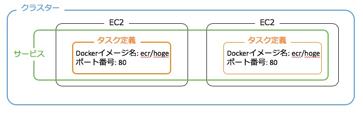
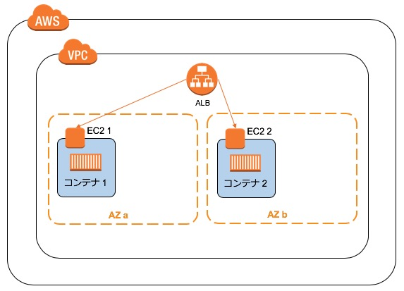
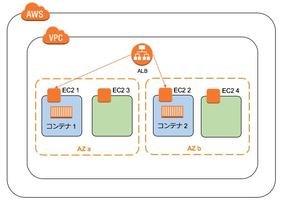
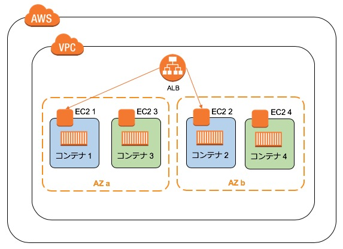
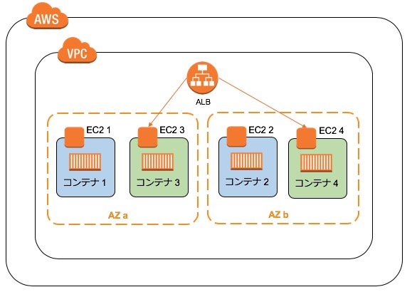
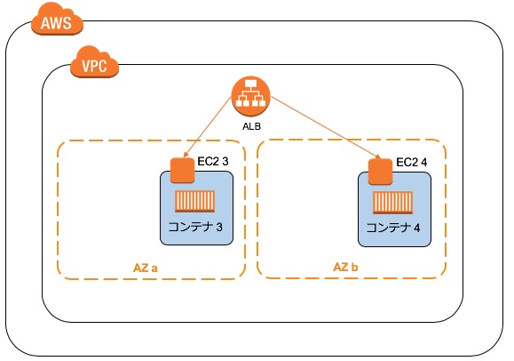
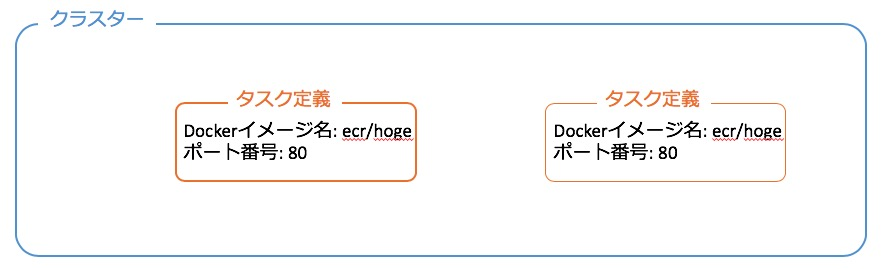
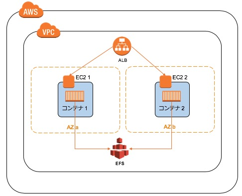

<!-- $theme: default -->
<!-- page_number: true -->

# AWS社内勉強会
## 第4回(AWSコンテナ関係)
- 講義実施者 : 荒木　泰詞
- 講義実施日 : 2018-08-XX

---
## 今回のゴール
- DockerをAWSで使うためのノウハウを共有する
- 付随してEFSとSSMについてのノウハウを共有する

---
## アジェンダ
- コンテナ
- Docker
- ECS
- EFS
- SSM
- まとめ

---
## コンテナ
### コンテナとは、リソースが隔離されたプロセス
  - 一つのOS上で複数同時稼働が可能
  - それぞれ独立したルートファイルシステム
    - UbuntuやCentOSなどを自分のPCに入れても影響なく使うことができる
  - 昔からある技術だが、2013年にDockerが登場したことでニーズが高まった

---
## コンテナ - 特徴
- リソース効率
  - オーバーヘッドが少ない
- スピード
  - 起動が高速
- 柔軟性
  - 削除や再生が簡単

---
## Docker
### Dockerとは、コンテナ型仮想化環境でアプリケーションを管理/実行するためのプラットフォーム
- オープンソース
- Linux/Windowsで稼働
- 豊富な機能
  - インフラのコード化
  - 複数コンテナ管理

---
## Docker - キーワード
- Dockerコンテナ
  - プロセスとして起動するアプリの実行環境
  - Dockerイメージから起動
- Dockerイメージ
  - OSやアプリを含むコンテナのテンプレート
  - Dockerレジストリに格納する
  - Dockerfileから作成する
- Dockerレジストリ
  - Dockerイメージを格納するレジストリ
  - パブリック/プライベートで構築可能
  - Docker Hubが有名
- Dockerfile
  - OSのイメージからアプリが動作する環境がコードとして記述されたファイル

---
## Docker
### Dockerイメージ作成
```markdown
Dockerfile -> docker build -> Dockerイメージ
```

### Dockerレジストリ登録
```markdown
Dockerイメージ -> docker push -> Dockerレジストリ
```

### Dockerレジストリ取得
```markdown
Dockerレジストリ -> docker pull -> Dockerイメージ
```

### Dockerコンテナ起動
```markdown
Dockerイメージ -> docker run -> Dockerコンテナ
```

---
## ECS
### ECS(Elastic Container Service)とは、AWS上でDockerコンテナを実行・管理するサービス
- ブルーグリーンデプロイが簡単

---
## ECS - キーワード
### タスク定義
- コンテナの情報を定義
  - Dockerイメージの指定
  - ポート番号指定
  - 変更はリビジョンとして履歴で管理
### サービス
- タスク定義を管理
  - タスクのリビジョン定義を指定
- 配置するコンテナの数を管理
- ALBと連携し、コンテナへのトラフィックを分散

---
## ECS - キーワード
### クラスター
- 起動タイプ: EC2
  - サービスを管理
  - コンテナインスタンスを管理
- 起動タイプ: Fargate
  - サーバーやクラスターの管理が不要になる
  - 詳細はのちほど
### コンテナインスタンス
- コンテナを配置するEC2
### ECR(Elastic Container Registry)
- AWSのDockerレジストリ

---
## ECS構成イメージ(起動タイプ: EC2)


---
## ECR
### ECRにDockerイメージを登録
```markdown
Dockerイメージ -> docker push -> ECR
```
- ECRにDockerイメージを登録することでタスク定義からECRのDockerイメージが参照できる

---
## ブルーグリーンデプロイ
### ブルーグリーンデプロイとは、システムのリリースを２つの環境を使って安全に素早く行うこと
- ブルーが現在動いている環境
- グリーンが新しいバージョンをリリースする環境
- グリーン環境リリース後に問題なければブルー環境を破棄する
  - 問題があればグリーン環境を破棄する
- サービスをほぼ停止することなくリリースできる

---
## ブルーグリーンデプロイ


---
## ブルーグリーンデプロイ - ECS
### リリース前の状態


---
## ブルーグリーンデプロイ - ECS
### グリーン環境作成


---
## ブルーグリーンデプロイ - ECS
### グリーン環境にリリース


---
## ブルーグリーンデプロイ - ECS
### グリーン環境切り替え


---
## ブルーグリーンデプロイ - ECS
### ブルー環境を破棄し、グリーン環境をブルー環境とする


---
## Fargate
### Fargateとは、サーバーやクラスターを管理することなくコンテナを実行できる
- タスク定義をするだけでコンテナが使える
- EC2の管理をしなくていい
- ブルーグリーンデプロイもできる
- docker execなどのdocker操作はできない

---
## Fargate構成イメージ


---
## EFS
### EFS(Elastic File System)とは、伸縮自在なファイルストレージ
- ストレージの容量が自動で増減される
- ファイルを共有できる
- 複数のEC2からマウントができる
  - マウントすることでEFSにアクセスできる
- 冗長化されている

---
### EFSとコンテナ
### EC2またはコンテナを冗長化して、ファイルを共有したいときにEFSを使う


---
## 今までの扱ったサービスのストレージ比較
||EBS|EFS|S3|
|-|-|-|-|
|料金|$0.12 /GB|$0.3 /GB|$0.03 /GB|
|保存容量|16TB|無制限|無制限|
|複数のサーバから<br>同時アクセス|不可|可|可|
|可用性|1AZ内で複製|複数AZで複製|複数AZで複製|
|スループット|1秒あたり1GB|1秒あたり数GB|遅い|

---
## SSM
### SSM(Systems Manager)とは、EC2、オンプレミスサーバーと仮想マシン、およびその他の AWS リソースを大規模に設定、管理するためサービス
### メンテナンスウィンドウ
- 定期的に行う管理作業やサービス停止の実施時間を定義
- EC2のパッチ適用やドライバー更新など
### ランコマンド
- 安全にインスタンス上の管理作業を実施
- EC2にssh接続せずに、cpなどのコマンドが実行できる

---
## SSM
### ドキュメント
- SSMの各サービスの挙動を定義する設定ドキュメント
  - 全てのEC2を停止するためのドキュメント等
- AWSがある程度のドキュメントを用意している
- ドキュメントを実行することで、記載した内容の作業が動作する
### パラメータストア
- 設定値やパスワードを管理する
- EC2からパラメータストアに設定した値を参照・変更できる
- 例えばコンテナ作成時にパラメータストアの値を使ってBasic認証のユーザ/パスワード値の設定ができる

---
## まとめ
- ECSを使うことでDockerが利用できる
- EFSやSSMを連携させることで柔軟なシステム構築ができる