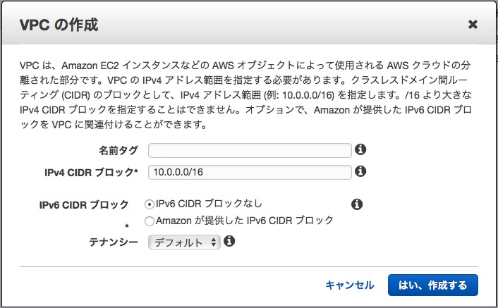
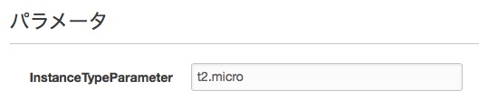
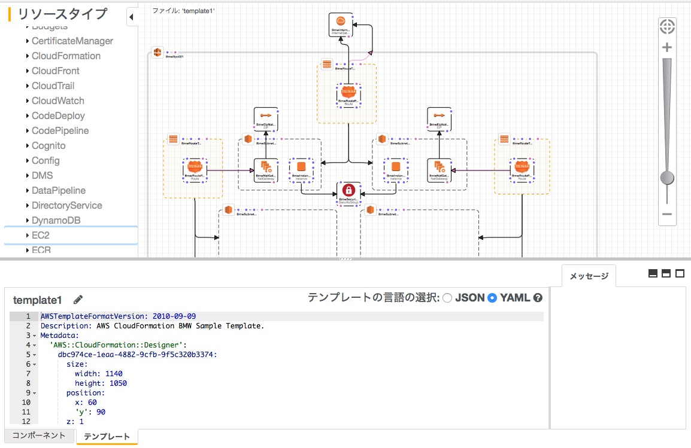
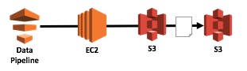

<!-- $theme: default -->
<!-- page_number: true -->

# AWS社内勉強会
## 第5回(AWS環境構築自動化)
- 講義実施者 : 荒木　泰詞
- 講義実施日 : 2018-08-XX

---
## 今回のゴール
- AWSにおける環境構築自動化の理解
- AWSの自動化サービスの理解

---
## アジェンダ
- AWSにおける環境構築自動化
- CloudForamtion
- Data Pipeline
- まとめ

---
## AWSにおける環境構築自動化
### なぜ自動化する？
- 作成した環境を別のリージョンでも使いたい
  - 開発環境、テスト環境、本番環境等
- 作成した環境を削除したあとに再度必要になった
- 自動化するとはコード化するということなので、バージョン管理ができる

---
## 自動化サービス
### CloudFormation
- AWSリソースの設定を定義ファイルに記載し、環境構築を行う
- これを今回は扱う
### OpsWorks
- Chefベースのインフラ構成管理サービス
- EC2への各種サービスのインストールや設定の自動化を行う
- これはまだ触ったことがないので割愛
### Elastic Beanstalk
- 定番インフラ構成の自動構築およびアプリケーションのデプロイの自動化サービス
- アプリケーションだけ作ればインフラ周りは自動で構築
- これはまだ触ったことがないので割愛

---
## CloudFormation
### CloudFormationとは、AWSのリソースの管理・構築を自動化するサービス
- AWSマネジメントコンソールでの手作業をJSON/YAMLで表現
- 作成したファイルのことを`テンプレート`と呼ぶ
- テンプレートから作成したものを`スタック`と呼ぶ
- スタックを削除することで一括で環境の削除ができる
- コードをグラフィカルに表示できるので構成がわかりやすい
- 一度作成すれば何度でも構築できる
- テスト環境や本番環境などの作成が簡単

---
## CloudFormation


<!-- *footer: 引用: https://www.slideshare.net/AmazonWebServicesJapan/aws-black-belt-online-seminar-2016-aws-cloudformation -->

---
## CloudFormation
### テンプレート例 - VPC作成
```
AWSTemplateFormatVersion: 2010-09-09
Resources:
  ExampleVpc:
    Type: 'AWS::EC2::VPC'
    Properties:
      CidrBlock: 10.0.0.0/16
```
---
## CloudFormation
### AWSマネジメントコンソールでVPC作成


---
## CloudFormation - テンプレート解説
### 形式
- JSONかYAMLで記載できるが、YAMLがおすすめ
- JSONは括弧が多い、カンマのつけ忘れ、コメントが書けない
### AWSTemplateFormatVersion
- テンプレートの形式バージョン
- 現状`2010-09-09`が唯一のバージョン
### Resources
- AWSのリソースを定義

---
## CloudFormation - テンプレート解説
```
Resources:
  ExampleVpc:
    Type: 'AWS::EC2::VPC'
    Properties:
      CidrBlock: 10.0.0.0/16
```
### ExampleVpc
- 任意のリソース名をつけてどんなリソースかわかりやすくする
### Type
- どのリソースか指定
- 自動生成されるのでそんなに意識しなくていい
### Properties
- リソースに応じたプロパティ
- [公式ドキュメント参照](https://docs.aws.amazon.com/ja_jp/AWSCloudFormation/latest/UserGuide/aws-resource-ec2-vpc.html)
- 設定値がよくわからないときはマネジメントコンソールから確認

---
## CloudFormation - その他のテンプレート要素
### Parameters
- CloudFormation実行時にテンプレートに渡すことができる値
- ResourceおよびOutputsで参照できる
```
Parameters:
  InstanceTypeParameter:
    Type: String
    Default: t2.micro
```
- 画面上での表示

- パラメータの参照
```
InstanceType: !Ref InstanceTypeParameter
```

---
## CloudFormation - その他のテンプレート要素
### Mappings
- キーに応じた値を特定できる
```
Mappings:
  MappingName:
    us-east-1:
      Name1: Value1
    ap-northeast-1:
      Name1: Value2
```
- 取得方法
```
Properties:
  sample: !FindInMap
    - MappingName
    - !Ref "AWS::Region"
    - Name1
```
###### `!Ref "AWS::Region"`はCloudForamtionを実行しているリージョン名を取得
###### 東京リージョンで実行していれば`ap-northeast-1`となる

---
## CloudFormation - その他のテンプレート要素
### Conditions
- 条件によってテンプレートの動きを制御する
- 下記の例では本番環境のときだけEC2を作成する
```
Parameters:
  Env:
    Description: System Environment
    AllowedValues:
      - dev
      - stg
      - prd
    Type: String
Conditions:
  IsProduction: !Equals 
    - !Ref Env
    - prd
Resources:
  Instance:
    Type: 'AWS::EC2::Instance'
    Condition: IsProduction
```

---
## CloudFormation - その他のテンプレート要素
### Description
- テンプレートファイルの概要などを記載

### Metadate
- デザイナで表示するときの各リソース配置情報

### Outputs
- 構築後のリソース情報を出力
- ALBのドメイン名を出力するときなどに使う

---
## CloudFormation
### デザイン表示


---
## DataPipeline
### DataPipelineとは、データの移動と変換を自動化するために使用するサービス
- どんな流れでデータを移動させるか定義
- 定義したあとはJSONファイルに出力できる
- 作成方法
  - よくあるユースケースのテンプレートを使う
  - カスタマイズした定義ファイルを使う
  - 専用GUIから作成
- スケジュール機能を持っている
- 処理の成功や失敗などの通知設定ができる
- データの変換や加工には別途プログラミングが必要
- 環境構築の自動化ではない

---
## DataPipeline - 使用例
### S3からS3にデータをコピーのイメージ

1. DataPipeline実行
1. EC2が自動的に起動
1. EC2がInput元のS3からOutput先のS3へコピーを行う
1. 処理完了後にEC2は自動的に削除

---
## DataPipeline - 使用例
### S3からS3にデータをコピーするときのデモを実施

---
## まとめ
- CloudForamtion
  - 環境構築手順をコード化
  - 構築の作成や削除が簡単
- DataPipeline
  - データの移動をコード化
  - DataPipelineが処理する環境は自動作成・自動削除